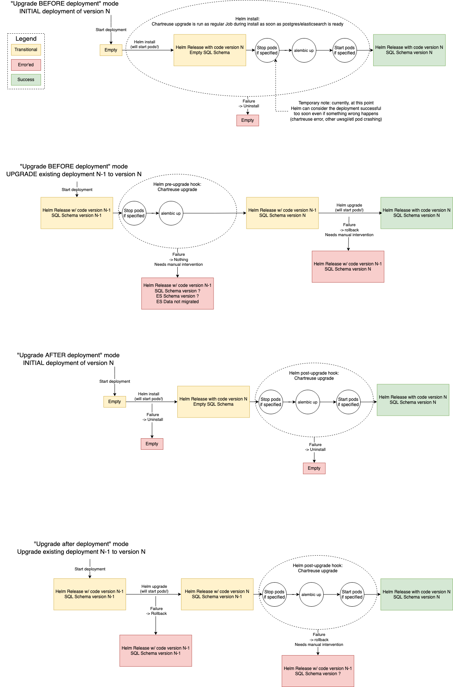

# Chartreuse: Alembic migration within kubernetes

Chartreuse is a wrapper around [Alembic](https://alembic.sqlalchemy.org) and [Eslembic](https://gitlab.cayzn.com/wiremind/commons/eslembic) to ease,
 detect and automate migrations on deployed applications.

Chartreuse is made to work as Helm hooks. You need to use Chartreuse a a sub-chart of your project.

# Install

This Python package requires a `Custom Resource Definition`:

    $ kubectl apply -f customResourceDescription-expecteddeploymentscales.yaml

# Configuration

TBD

## How it works

The state diagram of your application while upgrading using Helm and using Chartreuse for your migrations is as follows:

- The numbers in circles give the process steps when all go well.
- The diagram shows what could happen during an application
upgrade (starting from a version `V`) but the same scenario
applies to applications when installing them for the first time
(consider version `V` to be scratch).

- The diagram has been drawn using the free online software https://draw.io, the
source code is located at `doc/chartreuse_sd.xml`, feel free
to correct it or make it more understandable.

- In the end of an install/upgrade, whatever its state: succeeded or failed, make sure
that the pods were scaled up as expected, if it isn't the case, this should be done manually.

# Test

There are three kind of tests:

- Unit tests
- Integration tests: allows to run in a real environment, but still control chartreuse from the inside
- blackbox test: deploy a real Helm Release and test if databases are migrated. Requires the PYPI_PASSWORD_READONLY envvar to be set in order to fetch required eggs to build the test Docker image.
